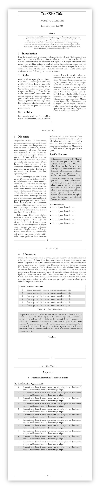

# Minimal RPG Template (LaTeX)

This repository contains a LaTeX template, mainly intended for for creating Old
School Revival (OSR) Tabletop Role-Playing Game Zines. This does not mean the
template can not be used for other purposes.

## Features

- A4 paper size.
- Double column layout.
- Alternating left and right binding offsets for print.
- Predefined sections for content.
- Header with title on each page.
- Footer with page numbers.
- Customizable margin settings.

## Dependencies

This template uses the following LaTeX packages:

- `extarticle` for the document class.
- `inputenc` and `fontenc` for special character support.
- `graphicx` for including graphics.
- `lipsum` for generating dummy text.
- `fancyhdr` for custom headers and footers.
- `multicol` for multi-column layout.
- `geometry` for setting page dimensions and margins.
- `coelacanth` for the main document font.

If you use a common LaTeX distibution, these packages are most likely already
included, but otherwise please ensure these packages are installed before
compiling.

## Usage

1. Clone or download this repository.
2. Open the `Main.tex` file in your preferred LaTeX editor.
3. Replace the contents with your own.
5. Compile the `.tex` file.

## Example

## License

This project is open source, under the MIT License
